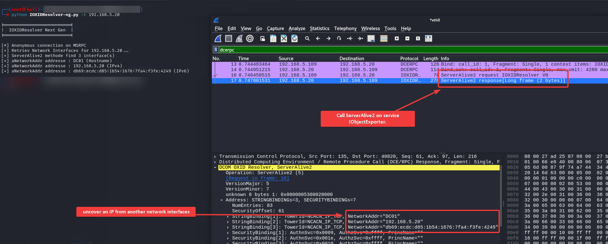

# IOXIDResolver-ng

## Introduction 

The IOXIDResolver.py-ng script is designed to explore the network interfaces of a target machine via the Microsoft Remote Procedure Call (MSRPC) protocol. The script interacts with the `IObjectExporter` service, exposed by MSRPC, to call the `ServerAlive2` method. This method returns the available network interfaces of the target machine.

## Setup
```bash
git clone https://github.com/Anh4ckin3/IOXIDResolver-ng.git
pip install -r IOXIDResolver-ng/requirements.txt

# usage
python3 IOXIDResolver-ng/IOXIDResolver-ng.py -t 127.0.0.1
```

## Usage
```python
python3 IOXIDResolver-ng.py --help        
usage: IOXIDResolver-ng.py [-h] -t TARGET [-u USERNAME] [-p PASSWORD] [-d DOMAIN] [-a {none,creds}]

Network interface recovery via MSRPC and IObjectExporter.

options:
  -h, --help            show this help message and exit
  -t TARGET, --target TARGET
                        target IP
  -u USERNAME, --username USERNAME
                        username
  -p PASSWORD, --password PASSWORD
                        password
  -d DOMAIN, --domain DOMAIN
                        Domain
  -a {none,creds}, --auth {none,creds}
                        auth methode (anonymous by default)
```

## Demo


## Resources

 - This tool is based on a work made by [Airbus security](https://airbus-cyber-security.com/the-oxid-resolver-part-1-remote-enumeration-of-network-interfaces-without-any-authentication/).
 - Article that helped me understand [juggernaut-sec.com](https://juggernaut-sec.com/ad-recon-msrpc/#Mapping_RPC_Endpoints_%E2%80%93_rpcmappy)


